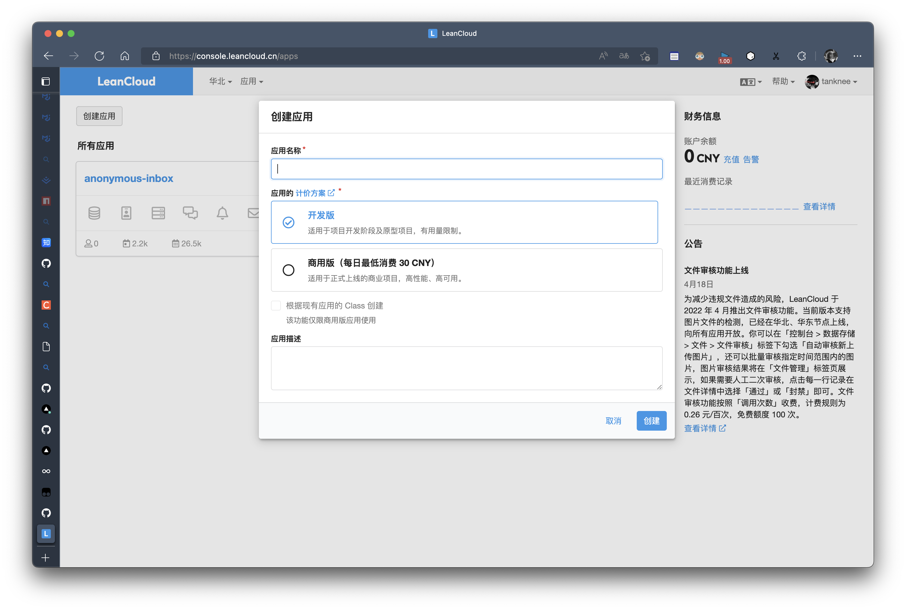
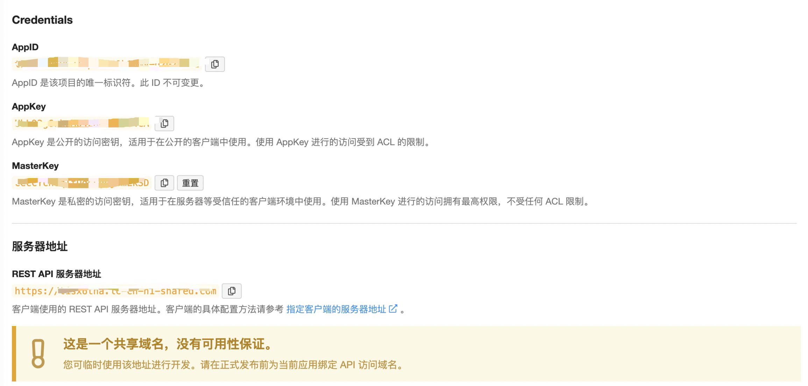
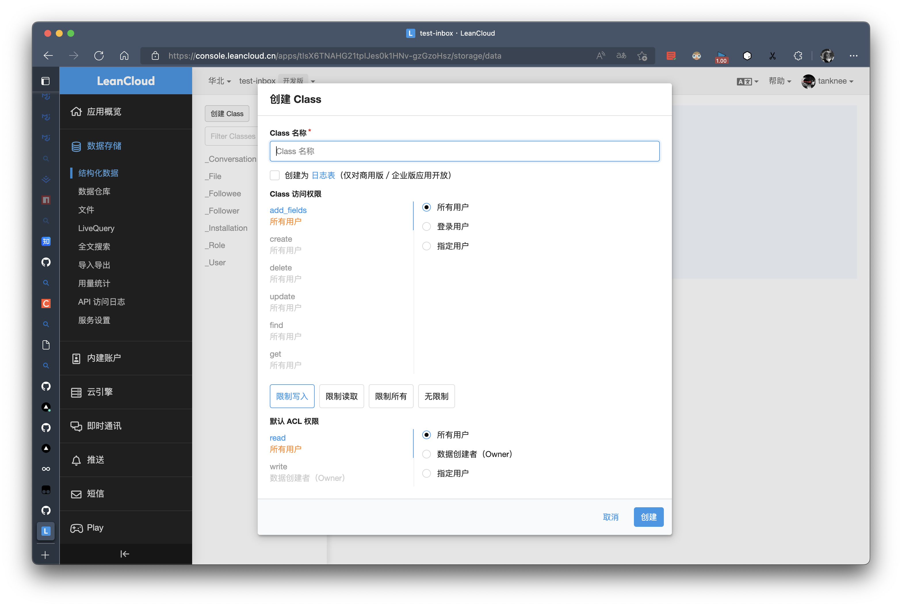
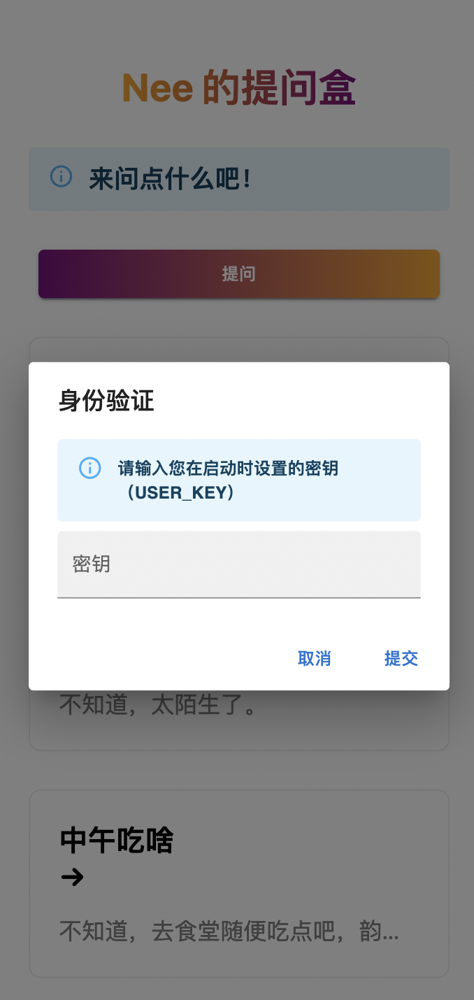

# 私有部署提问盒

这两年提问盒形式的匿名问答越来越多了，像在朋友圈流行的 Popi，在推特流行的那个匿名提问箱，还有以前 QQ 的悄悄话。玩这类匿名社交最有意思的事情就是猜测提问者是谁，提问者提问时的心态。读者在看提问盒的回答历史的时候可以快速建立回答者的初步形象，然后进一步推断作者是一个什么样的人。

## 匿名？

但是，匿名问答，真的可以匿名吗？很难！数据和流量太过重要，没有人可以舍弃，就算是那些声称极为注重隐私的公司，也会默默收集用户的页面浏览信息（例如浏览时长，用户来源，用户 IP 地址等）。我在最开始的时候并不想收集任何信息，希望做一个完全匿名，没有任何额外信息收集的提问箱，但是后来遇到了轰炸式提问，几分钟发了几十条，非常影响体验，所以我觉得还是要有所限制的（因为需要限定固定 IP 轰炸）。

## 社交监管？

众所周知，社交类应用有许多的限制，个人基本上不能搞社交类应用，特别是那些想要上架应用市场的，任何 UGC 都是要审查的，而且，网络上鱼龙混杂，难免有脚本小子来轰炸小网站，所以部署在自己的服务器上不是特别安全。

正好没开发过 Vercel 相关的应用，nextjs 也是久闻大名，我想是时候了，该上手试试。

## 物料准备

本来我想着 vercel 没有配套的数据库服务，用起来会很麻烦，所以就找个 SaaS 平台放数据，于是就想到了以前用过的 LeanCloud，知名的博客评论应用 Valine 就是用的这个服务商，基本上花不了什么钱，而且他们的文档写的很丰富，相当不错。缺点是部分功能需要自己的域名，而且要是备案过的域名。

当然，你也可以在自己的服务器上部署本项目，不过你仍然需要 LeanCloud 的数据库作为支撑，在下一个大版本我会提供更多的存储介质支持，并用 Vue 对项目进行重写。相关教程可以看这篇文章 https://www.tanknee.cn/2023/03/03/17。

> 之前我也打算做一个使用本地数据库的分支，这样就能直接部署到 railway 这样的平台上了（我是快写完了才发现有这样一个平台）。

所以我们需要以下准备：

*   一个 LeanCloud 账号

*   一个备案过的域名

*   一个 GitHub 账号

## 部署步骤

首先打开 [LeanCloud](https://www.leancloud.cn/) 平台，创建一个新应用：

>   LeanCloud 国际版已经通过测试，国际版不需要国内域名，可以直接使用 LeanCloud 提供的服务域名！

选择免费版即可，完全足够。

然后前往应用的设置-应用凭证页面保存凭证信息：

> 理论上这个临时服务器地址是可以用的，不过我还是建议使用自己的域名。

然后点击数据存储-结构化数据-创建 Class

此处我们需要创建三个类，分别是：

*   Answer：存放回答

*   Question：存放提问

*   Settings：存放一些设置信息，例如页面标题

接下来我们可以点击来在 vercel 上部署提问箱。环境变量需要正确填写，否则可能引发未知错误。

*   PORT（**必需**）：运行端口，直接填写 4000 就好。

*   LEANCLOUD\_APP\_ID（**必需**）：填写上文获取到的 LeanCloud 应用 APP ID 信息。

*   LEANCLOUD\_APP\_KEY（**必需**）：填写上文获取到的 LeanCloud 应用 APP KEY 信息。

*   LEANCLOUD\_SERVER\_URL（**必需**）：填写上文获取到的 LeanCloud 应用服务器地址信息。

*   USER\_KEY（**必需**）：提问箱登录的密码，注意保护隐私。

*   MAILER\_ACCOUNT：SMTP 邮箱账户（为了给提问箱的主人发送邮件，所以需要一个邮箱账号）。

*   MAILER\_PASSWORD：邮箱密码。

*   MAILER\_HOST： SMTP 服务的域名（例如：`smtp.163.com`）。

填写完成之后等待部署即可！

示例提问箱请查看：

*   <https://anonymous-question-box.vercel.app/>

*   <https://qb.tanknee.cn>

***

管理员用户可以通过点击标题来进入管理页面：

登录成功之后再次点击标题可以推出管理页面。
